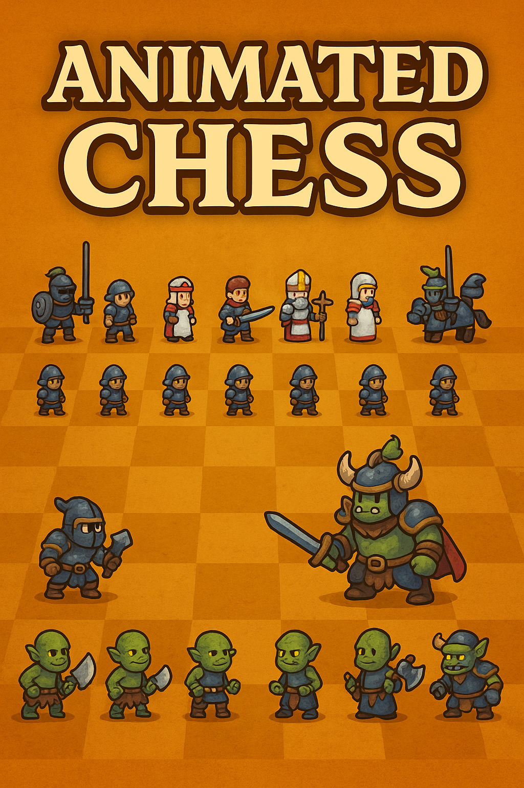

# 🎮 Animated Chess

Um jogo de xadrez moderno e interativo com animações fluidas, IA integrada com Stockfish e uma interface elegante, construído com React e TypeScript.



## ✨ Características

- 🎨 Interface moderna e responsiva
- 🎭 Animações fluidas para todas as peças
- 🤖 Motor de xadrez Stockfish (dificuldade ajustável)
- 🎯 Validação de movimentos em tempo real
- 📱 Design responsivo para todos os dispositivos
- 🏆 Sistema de pontuação

## 🚀 Tecnologias

- [React](https://reactjs.org/) - Biblioteca JavaScript para construção de interfaces
- [TypeScript](https://www.typescriptlang.org/) - Superset JavaScript com tipagem estática
- [Framer Motion](https://www.framer.com/motion/) - Biblioteca de animações
- [Tailwind CSS](https://tailwindcss.com/) - Framework CSS utilitário
- [Next.js](https://nextjs.org/) - Framework React para produção
- [Stockfish](https://stockfishchess.org/) - Motor de xadrez open source para a IA
- [Cypress](https://www.cypress.io/) - Framework de testes E2E
- [Jest](https://jestjs.io/) - Framework de testes unitários

## 🛠️ Instalação

1. Clone o repositório:

```bash
git clone https://github.com/seu-usuario/animated-chess.git
```

2. Instale as dependências:

```bash
cd animated-chess
npm install
```

3. Inicie o servidor de desenvolvimento:

```bash
npm run dev
```

4. Abra [http://localhost:3000](http://localhost:3000) no seu navegador.

## 🎮 Como Jogar

1. Escolha sua facção (Humanos ou Orcs)
2. Selecione uma peça clicando nela
3. As casas válidas para movimento serão destacadas
4. Clique na casa desejada para mover a peça
5. A IA (Stockfish) responde automaticamente com sua jogada
6. Capture peças adversárias movendo para suas casas
7. O objetivo é dar xeque-mate ao rei adversário

## 🎨 Animações

O jogo inclui várias animações para tornar a experiência mais imersiva:

- **Idle**: Peças com animação suave de respiração
- **Walk**: Movimento fluido ao trocar de posição
- **Attack**: Animação de ataque ao capturar peças
- **Hit**: Efeito visual quando uma peça é atacada
- **Death**: Animação de desaparecimento quando capturada

## 📱 Responsividade

O jogo é totalmente responsivo e funciona em:

- Desktop
- Tablet
- Smartphone
- Orientação paisagem e retrato

## 🧪 Testes

O projeto possui uma suíte completa de **70 testes E2E** usando Cypress.

### Executar Testes

```bash
# Modo interativo (recomendado para desenvolvimento)
npm run cypress:open

# Modo headless (ideal para CI/CD)
npm run cypress:run

# Executar em um navegador específico
npm run cypress:run:chrome
```

### Cobertura de Testes

- ✅ **13 testes** - Inicialização do jogo
- ✅ **10 testes** - Movimentação de peças
- ✅ **12 testes** - Gerenciamento de turnos
- ✅ **14 testes** - Sistema de reset
- ✅ **11 testes** - Histórico de movimentos
- ✅ **12 testes** - Cenários de fim de jogo

📖 **Documentação completa**: [cypress/README.md](cypress/README.md)

## 📜 Scripts Disponíveis

```bash
npm run dev          # Inicia servidor de desenvolvimento
npm run build        # Gera build de produção
npm run start        # Inicia aplicação em produção
npm run lint         # Executa ESLint
npm test             # Executa testes Jest
npm run cypress:open # Abre interface do Cypress
npm run cypress:run  # Executa testes Cypress (headless)
```

## ☁️ Deploy na Vercel

Este projeto está pronto para ser publicado na [Vercel](https://vercel.com/) utilizando a configuração incluída em `vercel.json`.

1. Crie um novo projeto na Vercel e importe este repositório.
2. Selecione **Root Directory** como a raiz do repositório (onde estão `package.json` e `next.config.ts`).
3. Confirme os comandos sugeridos: `npm ci` para instalação e `npm run build` para o build de produção.
4. Clique em **Deploy**. A Vercel usará a pasta `.next` gerada pelo build para servir o aplicativo.
5. Para pré-visualizar localmente com o mesmo comportamento do deploy, utilize `npm run dev`.

## 🤝 Contribuindo

Contribuições são bem-vindas! Sinta-se à vontade para:

1. Fazer um Fork do projeto
2. Criar uma branch para sua feature (`git checkout -b feature/AmazingFeature`)
3. Commit suas mudanças (`git commit -m 'Add some AmazingFeature'`)
4. Push para a branch (`git push origin feature/AmazingFeature`)
5. Abrir um Pull Request

## 📝 Licença

Este projeto está sob a licença MIT

## 👥 Autores

- José Trovarelli Neto - [@Trovarelli](https://github.com/Trovarelli)

## 🙏 Agradecimentos

- [Chess.com](https://www.chess.com/) pela inspiração
- [Stockfish](https://stockfishchess.org/) pelo motor de xadrez open source
- [Framer Motion](https://www.framer.com/motion/) pelas animações
- [Tailwind CSS](https://tailwindcss.com/) pelo design

---

⭐️ Se você gostou do projeto, não se esqueça de dar uma estrela!
